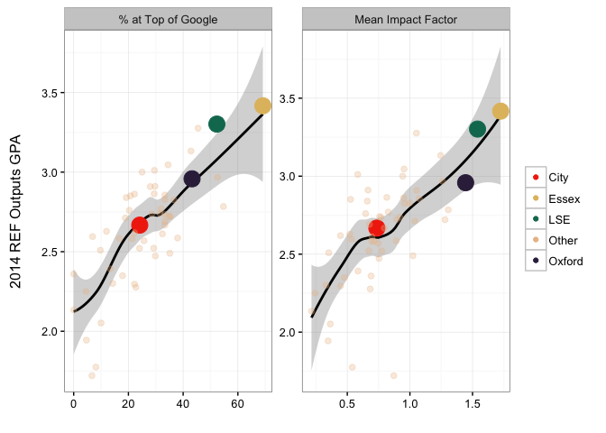
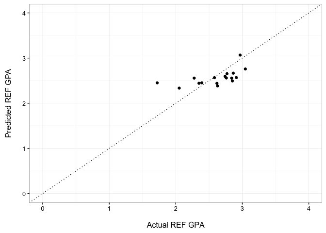
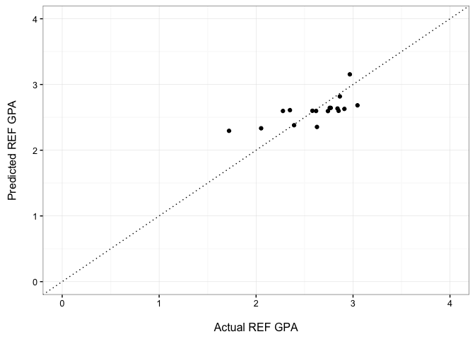

# REF IR/Political Science Prediction Models (version 0.1)
Christopher Gandrud  
23 February 2016  

I conducted a simple Random Forest Regression to examine how IR/Political Science REF 2014 Output GPAs could be predicted using:

- **Mean Impact Factor** for all of the journal article submissions that each university made. Note: if a journal was not assigned an impact factor[^impact_caveat] it is effectively given an impact factor of 0.

- **Percent** of article submissions from journals in the **top 20** IR or Political Science categories assembled by Google Scholar.

Both of these metrics are highly correlated with REF Output GPAs. Mean impact factor has a correlation coefficient of 0.68 with REF Output GPAs and the REF GPA correlation the Google Scholar metric is 0.76. Figure 1 further illustrates these close relationships and City University's placement within them. 

It is important to note that neither of these metrics contain information on books and other non-journal materials which are also submitted to the REF.

Comparing Universities' REF 2014 Output GPA to Journal Submission Metrics

# More Complex Model: Google Scholar + Impact Factor

To examine how well these journal metrics could predict REF Output GPAs I first ran the random forest regression model on a random sample of 70% of the 56 universities (i.e. 38) that made REF submissions for IR/Political Science. I then used the estimates from the model to predict the REF Output scores of the remaining 30% (i.e. 17 universities). Figure 2 compares the actual REF GPA scores to the predictions. Note: if the model perfectly predicted the GPA score then each dot would lie one the 45 degree line.

Actual vs. Predicted 2014 REF Output GPAs Using Both Journal Metrics for a Test Set of 17 Randomly Selected Universities

The mean prediction error when using the two journal metrics was only 0.05. In other words, on average the model incorrectly predicted the REF GPA score by 0.05 GPA points or only 1.2% of the GPA scale.

# Simpler model: Google Scholar-only

The percentage of journal submissions in the top Google Scholar lists is more strongly correlated with REF GPA scores than impact factors. Would a simpler model using just the Google Scholar metric perform just as well as the more complex two metric model?

Actual vs. Predicted 2014 REF Output GPAs Using Google Scholar Metrics for a Test Set of 17 Randomly Selected Universities

The mean prediction error when using only the Google Scholar metric was only 0.01. In other words, on average the model incorrectly predicted the REF GPA score by 0.01 GPA points or 0.3% of the GPA scale. The Goolge Scholar-only model actually out performs the the more complex model that also included information on impact factors.

# Top 20 (IR + PS) Google Scholar Journals (February 2016)

For reference, the following is a list of the top 20 journals in the Google Scholar IR and Political Science categories. We also include the most recent Thomson-Reuters Impact factor to enable comparison between the two metrics.

Journal                                        TR Impact Factor
--------------------------------------------  -----------------
political analysis                                        4.655
american political science review                         3.688
journal of peace research                                 3.387
american journal of political science                     3.269
annual review of political science                        3.140
international organization                                3.019
european journal of political research                    2.508
world politics                                            2.450
journal of politics                                       2.255
governance                                                2.237
perspectives on politics                                  2.132
comparative political studies                             2.028
foreign affairs                                           2.009
british journal of political science                      1.987
european journal of international relations               1.972
jcms                                                      1.855
party politics                                            1.830
journal of european public policy                         1.817
international studies quarterly                           1.705
political behavior                                        1.691
journal of conflict resolution                            1.609
west european politics                                    1.576
security dialogue                                         1.356
international affairs                                     1.246
electoral studies                                         1.182
journal of democracy                                      1.180
political research quarterly                              1.149
review of international studies                           1.087
global governance                                         1.016
third world quarterly                                     0.981
political studies                                         0.939
international studies review                              0.878
millennium                                                0.841
washington quarterly                                      0.788
journal of european integration                           0.656
international studies perspectives                        0.652
pacific review                                            0.527
ethics & international affairs                            0.453

[^impact_caveat]: E.g. new journals and journals not included in the impact factor list used. Note that we attempted to match all of the sumbitted articles' journal names with those on the impact factor list. However, due to spelling  variations in the two sets of journal names, some matches may not have been made.

[^HEFCE]: <http://www.dcscience.net/2015_metrictideS2.pdf>
